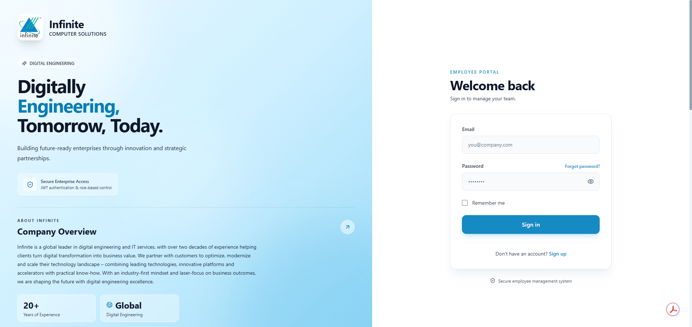
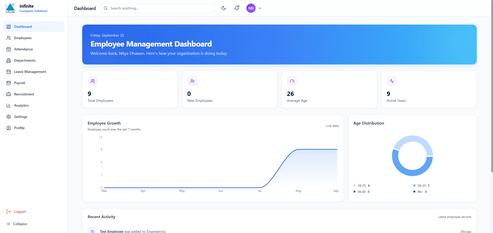
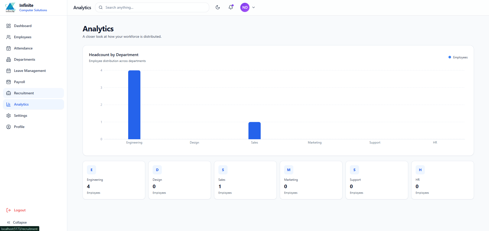
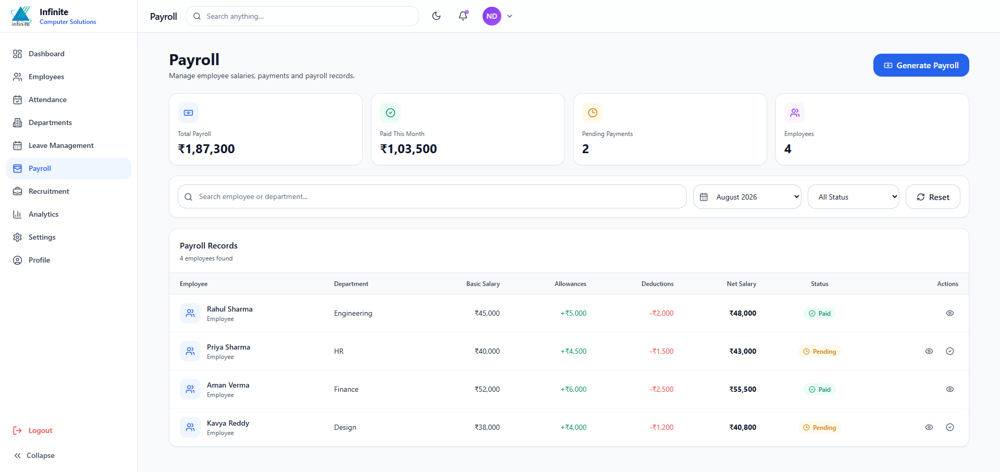
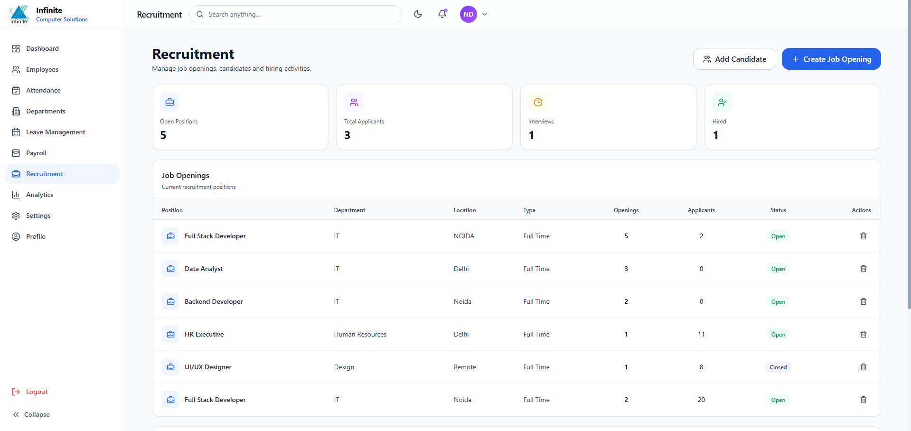

# HR Management Portal

A full-stack HR Management Portal designed to streamline employee and HR operations through a centralized web application.

## 🚀 Features

- User Authentication
- HR Dashboard
- Employee Management
- Department Management
- Payroll Management
- Leave Management
- Recruitment Management
- User Profile Management
- Settings
- Role-Based Access Control
- Responsive User Interface

## 🛠️ Tech Stack

### Frontend
- React.js
- JavaScript
- Tailwind CSS
- Vite

### Backend
- Node.js
- Express.js

### Database
- PostgreSQL

### Development Tools
- Git
- GitHub
- VS Code

## 📁 Project Structure

```text
HR-Management-Portal/
│
├── backend/
│   ├── controllers/
│   ├── middleware/
│   ├── routes/
│   ├── db.js
│   └── server.js
│
├── frontend/
│   ├── public/
│   └── src/
│       ├── components/
│       ├── pages/
│       └── routes/
│
├── .gitignore
├── package.json
└── README.md

## 📸 Screenshots

### Login


### Dashboard


### Analytics


### Employee & Leave Management


### Payroll


### Recruitment
